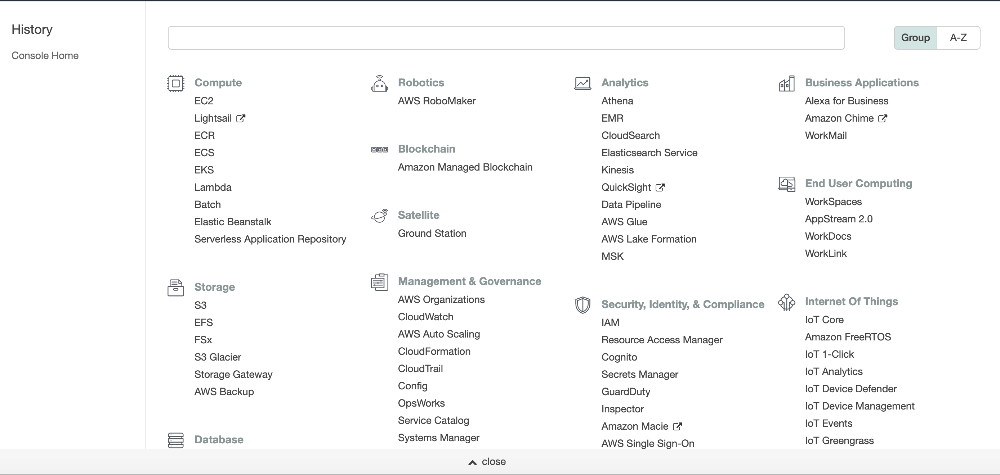
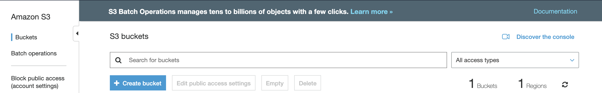
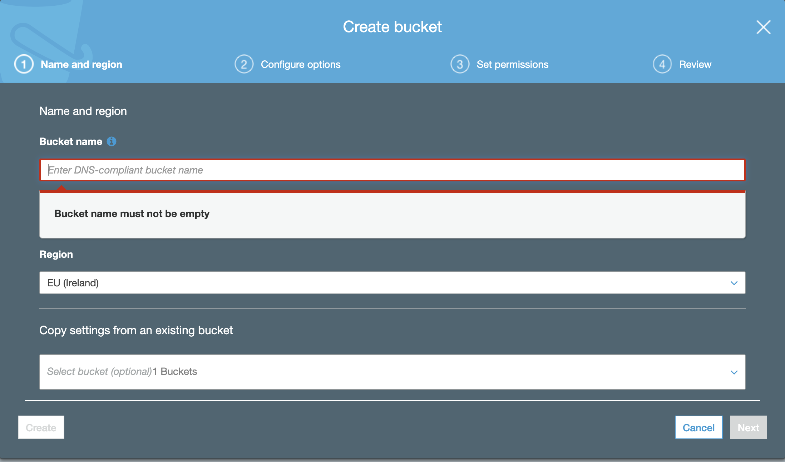
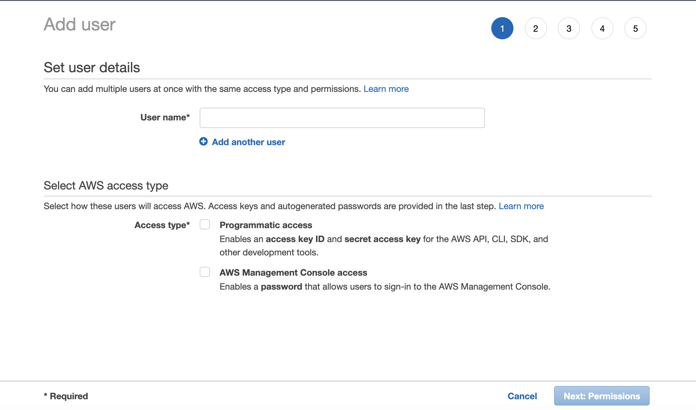
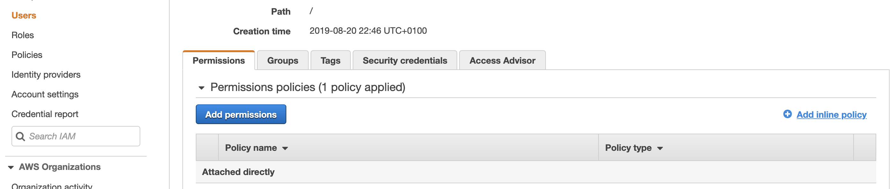
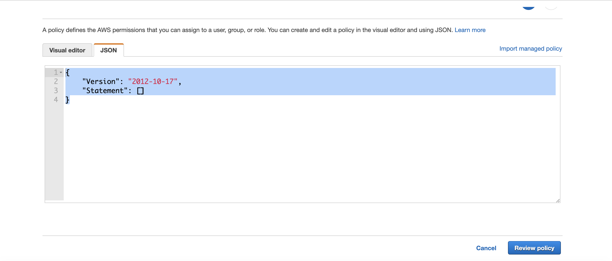

Handling media files in python couldn't be any simpler with pythons Pillow. Boto3, an awesome python library, takes all of the stress out of off loading
those media files to aws s3. In this article we will take a brief look at installing pillow and reading in media files in
base64 then shift focus to aws offload of said files to an s3 bucket. In the next installment we will go through resizing images and
putting it all together in a realistic api endpoint scenario.Like I said the libraries do most of the heavy lifting but there are a few gotcha's mainly in aws configuration both on
your server/dev environment and setting up the s3 bucket with correct permissions.

---
## Pillow Install & Media Handling
---

Like I said things couldn't be an simpler, you can check out the official documentation [here](https://pillow.readthedocs.io/en/stable/)
if you would like to explore things further. I am going to assume some familiarity with python and pythons development env in general,
its always recommended that you use virtual environments for installing dependencies or the pythons pipenv alternatively. You can
check those out here: [virtualenv](https://docs.python-guide.org/dev/virtualenvs/), [pipenv](https://github.com/pypa/pipenv).

To install Pillow simply run the following
```bash
pip install Pillow
```

In your python file import from the Pillow library Image and from the standard library BytesIO, and base64

```python
from io import BytesIO
from PIL import Image

import base 64

```

Once imported we can start using them, lets create a function that takes in an image (base64 format), decodes and saves to disk
in a temporary/uploads folder relative to your python file. Be sure to create the temp/uploads directory relative to the python
file.

```python
def save_image_to_disk(img):
    # The image is given in base64 so we need to decode
    # before saving the image to disk
    image = Image.open(BytesIO(base64.b64decode(img)))
    # Once decoded we can save the image
    image.save('/temp/uploads/test.jpg')

```

If all ahs gone well you should now see the image saved in your temp/uploads folder, your folder structure should look something like
this:

```bash
    └── project
        ├── save_image_to_disk.py
        ├── temp
            └── uploads
                ├── test.jpg
```

---
## AWS s3 offload
---
Now for the hardest part, offloading the image to aws. Like I said before the libraries do most of the heavy lifting but
setting up aws itself can be tricky. First you are going to need a free account, you can create one [here at the aws management console](https://aws.amazon.com/console/).

Once you have created your free account go to the console and select the services link on the top left which should redirect you to the below
page with a list of all available services.



Under storage select the s3 service as this is the one that most interests us. You may be asked to select a tier, in this case there should be three options
available to you. For the purposes of this tutorial the free tier is perfectly fine. Once selected you will be asked to enter your card
details, don't worry you shouldn't be charged.

Once you have set up correctly you should see a bucket page similar to the below picture.



At this point you can create your bucket and give it a name by selecting the create bucket on left head side.



Be sure to select the region most applicable to you, this is where the servers will be located that will host your storage bucket. Next
skipping the manage users section (we will come back to this later) you may want to set up public permissions so as anyone may read images
from your bucket. Not to worry however you can always re-configure these permissions after on. Then just follow the last step and create
your bucket.

Once your bucket has been created you can now set up a user with the appropriate access permissions. Go back to the services page and
click on the IAM link under Security, Identity, & Compliance section. This should should bring you to the IAM console, where on the left hand side you should
see a USERS section, click here to follow through and create a new user.



Be sure that you select the programmatic access box so as your user will have programmatic access to the bucket. Skip all the way
through to creating the user and this should give you both an access key ID and an secret access key, these are what our python
program will use in order to authenticate with the aws api. In a separate tab, go back to the aws IAM section and you should now see a list of users with
the user you have just created. Click on the user and you will see a detail with an arn link that is unique, copy this link and go back to your
s3 bucket. Select manage on the newly created bucket and go to the permissions tab, here we can create a new bucket policy, select the bucket policy tab
and paste the following in (making the adjustments for your own bucket)

```json

{
    "Version": "2012-10-17",
    "Id": "Policy1488494182833",
    "Statement": [
        {
            "Sid": "Stmt1488493308547",
            "Effect": "Allow",
            "Principal": {
                "AWS": "arn:aws:iam::281979644754:user/sample-user" // paste in your own user arn here
            },
            "Action": [
                "s3:ListBucket",
                "s3:ListBucketVersions",
                "s3:GetBucketLocation",
                "s3:Get*",
                "s3:Put*"
            ],
            "Resource": "arn:aws:s3:::img-bucket-00123" // paste in your own arn for the bucket
        }
    ]
}
```

Once you have made the appropriate changes just hit save and move on to the CORS (Cross-origin resource sharing) tab where you may
paste the following example in.

```xml
<?xml version="1.0" encoding="UTF-8"?>
<CORSConfiguration xmlns="http://s3.amazonaws.com/doc/2006-03-01/">
  <CORSRule>
    <AllowedOrigin>*</AllowedOrigin> <!-- for development you can leave as is -->
    <AllowedMethod>GET</AllowedMethod>
    <AllowedMethod>POST</AllowedMethod>
    <AllowedMethod>PUT</AllowedMethod>
    <MaxAgeSeconds>3000</MaxAgeSeconds>
    <AllowedHeader>Authorization</AllowedHeader>
  </CORSRule>
</CORSConfiguration>
```
Now you can jump back over to the user IAM and you can add the appropriate user policy. Click on the user you created and
select the Add Inline policy seen below.



Once here you can create a new custom policy and copy and paste the below in.




```json
{
    "Version": "2012-10-17",
    "Statement": [
        {
            "Effect": "Allow",
            "Action": [
                "s3:ListAllMyBuckets",
                "s3:PutObject",
                "s3:GetObject"
            ],
            "Resource": [
                "arn:aws:s3:::*"
            ]
        }
    ]
}
```
Now that's it for the aws configuration, now we need to create a aws/config on our machine with the access keys seen earlier.
Go back to your desktop and create a .aws directory with both a config file and a credentials file.

```bash
mkdir .aws && touch .aws/config && touch .aws/credentials
```

Once you have created those two files you may paste in your credentials as shown below

```bash
vim .aws/credentials

[default]
aws_access_key_id=YOUR_ACCESS_KEY
aws_secret_access_key=YOUR_SECRET_ACCESS_KEY
```

In your config file which is optional just specify the region i.e eu-west ect... Now we are ready to use boto3 and connect to aws
simply install boto3 using pip

```bash
pip install boto3
```

And import the library into your python project like so

```python
import boto3
```

Now back to our python function after the image has been saved we can offload it to the aws s3 bucket like so

```python
def save_image_to_disk(img):
    # The image is given in base64 so we need to decode
    # before saving the image to disk
    image = Image.open(BytesIO(base64.b64decode(img)))
    # Once decoded we can save the image
    image.save('/temp/uploads/test.jpg')
     # off load the asset to aws
     try:
        s3 = boto3.client('s3')
        s3.upload_file(temp_location, 'django-flat-share-developemnt-123456', img_name)
        return "successfully offloaded"
      Except:
        return "An error occurred", sys.exc_info()[0]
```
If all has gone well the image should have been offloaded to your newly created bucket, simply go to the bucket and check.
Now everything seems easy thus far, but as I said there can be some gotchas, one such is the TimeSync Error. Chances are if
you are developing locally on you own machine everything should go smoothly, however if you are working in a VM or deploying an application
to a ubuntu server you may have sync issues in regards to the aws servers and the linux machine. To check this you my run the timedatectl
command from your shell

```bash
timedatectl
        Local time: Wed 2019-08-27 18:08:51 IST
                  Universal time: Wed 2018-06-13 12:38:51 UTC
                        RTC time: Wed 2018-06-13 12:38:51
                       Time zone: Asia/Kolkata (IST, +0530)
       System clock synchronized: no
systemd-timesyncd.service active: yes
                 RTC in local TZ: no
```
The above output shows that the system clock is not synchronised and the time is most likely wrong. One way to fix this is
to use ntp which still works in Ubuntu 18.04. Run the following command to install ntp.

```bash
sudo apt install ntp
```
After its installed you can check its working by running `ntpq -p` which should yield output similar to the following

```bash
~$ ntpq -p
     remote           refid      st t when poll reach   delay   offset  jitter
==============================================================================
 0.ubuntu.pool.n .POOL.          16 p    -   64    0    0.000    0.000   0.000
 1.ubuntu.pool.n .POOL.          16 p    -   64    0    0.000    0.000   0.000
 2.ubuntu.pool.n .POOL.          16 p    -   64    0    0.000    0.000   0.000
 3.ubuntu.pool.n .POOL.          16 p    -   64    0    0.000    0.000   0.000
 ntp.ubuntu.com  .POOL.          16 p    -   64    0    0.000    0.000   0.000

```

Then in your /etc/crontab file add `@reboot root /usr/sbin/ntpd -n` so that the ntpd will automatically start when the
system reboots.

Then simply reboot using `sudo service ntp reload` and that's it, you may verify it worked by running the `timedatectl`
command again and should see that the `System clock synchronized: yes` has been set to yes and the time should now be correct.
Your python function should now be capable of offloaded an image to aws. I hope this helps, in the next article I will go through
how you might put all of this together in an api and use pillow to resize images so you don't need to mess around with javascript.
